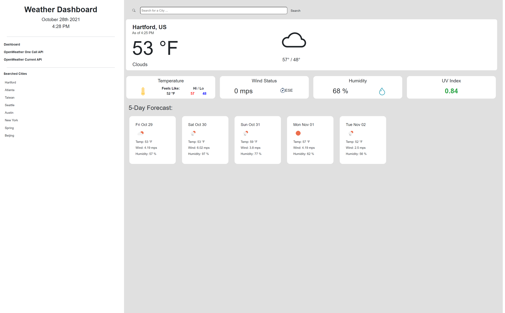

# WEATHER DASHBOARD

## CONTENTS OF THIS FILE

* Introduction
* How to Use
* User Story
* Acceptance Criteria
* Deployment
* Contribution

## INTRODUCTION

Weather Dashboard  
Uses OpenWeather One Call and OpenWeather Current API to retrieve weather data for cities.  
 
Built With:
- HTML
- CSS
- JavaScript
- Bootstrap
- jQuery
- OpenWeather API

## HOW TO USE

- Go to the webpage https://paperpatch.github.io/weekly-challenge-6/
- Default City will be Hartford, US. Enter a city in the search function to load up a new city.
- Searched cities will be appended to a list on the side. Clicking on it will load up that particular city.
- City list will be saved on your local storage. (Go to your webpage developer tools, `For Chrome Use F12`, and navigate to Developer Tools --> Application --> Storage --> Local Storage )

 

## USER STORY
AS A traveler  
I WANT to see the weather outlook for multiple cities  
SO THAT I can plan a trip accordingly  

## ACCEPTANCE CRITERIA

GIVEN a weather dashboard with form inputs  
WHEN I search for a city  
THEN I am presented with current and future conditions for that city and that city is added to the search history  
WHEN I view current weather conditions for that city  
THEN I am presented with the city name, the date, an icon representation of weather conditions, the temperature, the humidity, the wind speed, and the UV index  
WHEN I view the UV index  
THEN I am presented with a color that indicates whether the conditions are favorable, moderate, or severe  
WHEN I view future weather conditions for that city  
THEN I am presented with a 5-day forecast that displays the date, an icon representation of weather conditions, the temperature, the wind speed, and the humidity  
WHEN I click on a city in the search history  
THEN I am again presented with current and future conditions for that city  

## DEPLOYMENT
[Weather Dashboard Site](https://paperpatch.github.io/weekly-challenge-6/)

Version edits and changes can be found in Github commit changes [here](https://github.com/paperpatch/weekly-challenge-6/).

## CONTRIBUTION
Made by Patrick Chen